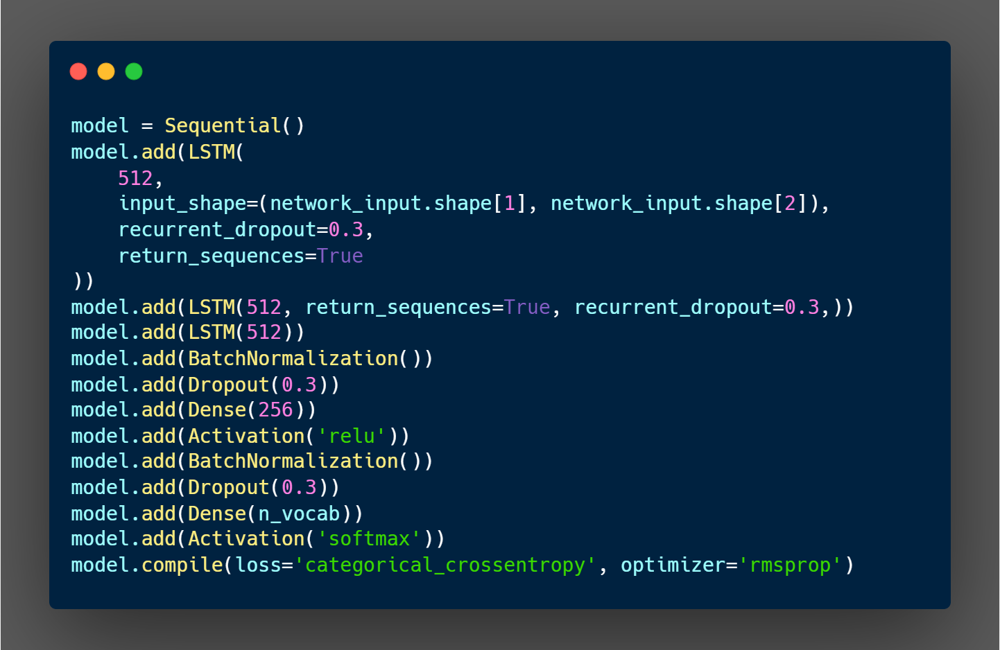

## __LoFi Music Generator with LSTM model__
A LoFi music webplayer with AI generated tracks that utilizes LSTM model to generate music. Try out the webplayer [here](https://melo04.github.io/lofi-generator-LSTM/). For how I built it, check out the blog post [here](https://melodykoh.vercel.app/blog/lofi-generator-lstm).

The LSTM model is trained on MIDI dataset obtained from [Zachary Katnelson](https://www.kaggle.com/datasets/zakarii/lofi-hip-hop-midi) and the webplayer is built with [Tone.js](https://tonejs.github.io/). Users could chose the theme of the music, the drum beats as well as the movie dialogues to be played. The model will generate the music based on the user's input.


## __What is LSTM__
LSTM, or Long Short-Term Memory, is a type of Recurrent Neural Network (RNN) that is capable of learning long-term dependencies. It is widely used in sequence prediction problems such as language modeling, text generation, and music generation. LSTM is able to remember information for long periods of time, making it suitable for generating music. Below depicts the architecture of the LSTM model used in this project.



To run the LSTM model locally, clone the repository and cd into the directory of lstm-model
1. Then run the following command:
```bash
python lstm.py
```
2. After that, run:
```bash
python predict.py
```